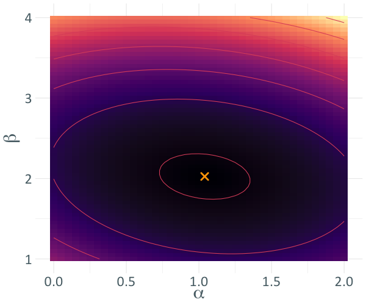
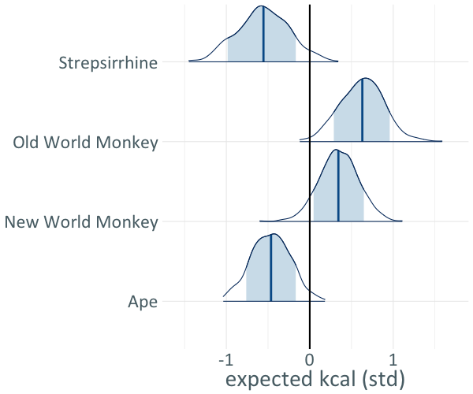
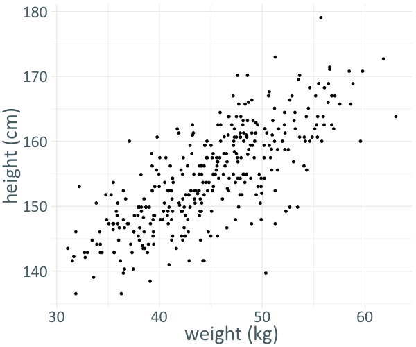
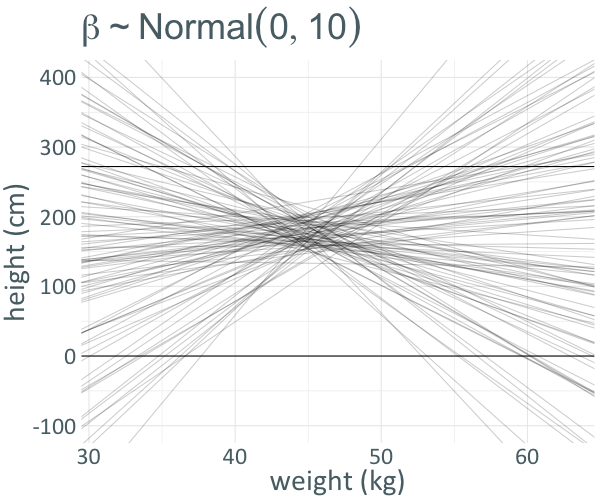
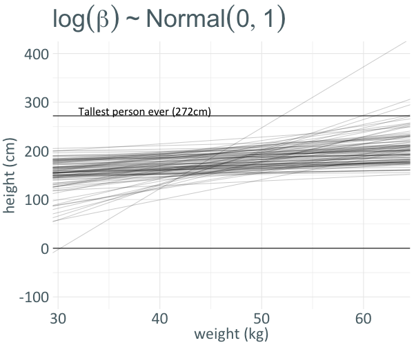
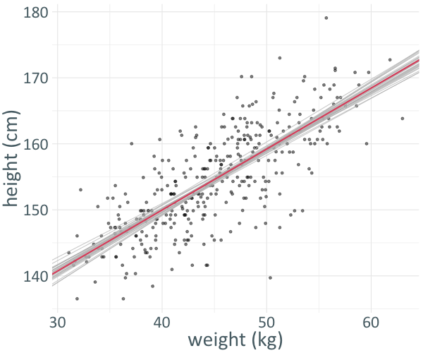

```{r setup, include=FALSE}
options(htmltools.dir.version = FALSE)
options(servr.daemon = TRUE)#para que no bloquee la sesión
```

```{r xaringan-themer, include=FALSE, warning=FALSE}
library(xaringanthemer)
library(ggplot2)
library(ggthemes)

xaringanExtra::use_share_again()
xaringanExtra::use_fit_screen()
xaringanExtra::use_tachyons()

style_solarized_light(
  title_slide_background_color = "#586e75",# base 3
  header_color = "#586e75",
  text_bold_color = "#cb4b16",
  background_color = "#fdf6e3", # base 3
  header_font_google = google_font("DM Sans"),
  text_font_google = google_font("Roboto Condensed", "300", "300i"),
  code_font_google = google_font("Fira Mono"), text_font_size = "28px"
)
# clipboard
htmltools::tagList(
  xaringanExtra::use_clipboard(
    button_text = "Copy code <i class=\"fa fa-clipboard\"></i>",
    success_text = "Copied! <i class=\"fa fa-check\" style=\"color: #90BE6D\"></i>",
    error_text = "Not copied 😕 <i class=\"fa fa-times-circle\" style=\"color: #F94144\"></i>"
  ),
  rmarkdown::html_dependency_font_awesome()
  )
## ggplot theme
theme_Publication <- function(base_size = 14, base_family = "helvetica") {
    (theme_foundation(base_size = base_size, base_family = base_family)
        + theme(plot.title = element_text(face = "bold",
                                          size = rel(1.2), hjust = 0.5),
                text = element_text(),
                panel.background = element_rect(colour = NA),
                plot.background = element_rect(colour = NA),
                panel.border = element_rect(colour = NA),
                axis.title = element_text(face = "bold",size = rel(1)),
                axis.title.y = element_text(angle=90,vjust =2),
                axis.title.x = element_text(vjust = -0.2),
                axis.text = element_text(), 
                axis.line = element_line(colour="black"),
                axis.ticks = element_line(),
                panel.grid.major = element_line(colour="#f0f0f0"),
                panel.grid.minor = element_blank(),
                legend.key = element_rect(colour = NA),
                legend.position = "bottom",
                legend.direction = "horizontal",
                legend.key.size= unit(0.2, "cm"),
                ##legend.margin = unit(0, "cm"),
                legend.spacing = unit(0.2, "cm"),
                legend.title = element_text(face="italic"),
                plot.margin = unit(c(10,5,5,5),"mm"),
                strip.background = element_rect(colour = "#f0f0f0",fill = "#f0f0f0"),
                strip.text = element_text(face="bold")
                ))
    
}

```

class: inverse, center, middle
# Intro 

---

# Maximum Likelihood estimation

  - Up to this point we have been using the Maximum Likelihood principle
  - ML has many advantages:

    - General
    - (mostly) Automatic
    - Good theoretical justification
    - Good performance
    
---

# The Maximum Likelihood way

.pull-left[
- Given some data...

  $y = \{ y_1, \cdots, y_n \}$

- Define an observational model: 
  
  $P(y|\theta) = L_y(\theta)$

- Maximize the likelihood over the parameter space: 
  
  $\hat{\theta} =\underset{\theta \in \Omega}{\operatorname{arg max}} \left [ L_y(\theta) \right ]$
]
--

.pull-right[

- Any further inference uses this ML estimator:

.center[
<div class="custom-box">
 \(\mu = f(\hat{\theta}) \)
</div>
]
]

---

# Log Likelihood surface

.center[

$y \sim Normal(\alpha + \beta x, \sigma)$

```{r, out.width= "50%", echo=FALSE}

```
]
---

class: inverse, center, middle
# Bayes

---

# Rev Thomas Bayes (1701 – 1761)


.center[
```{r, out.width= "50%", echo=FALSE}

```
]

---

# Product rule (or Bayes Theorem)

.center[
$$
P(AB) = P(A|B)P(B) = P(B|A)P(A)
$$


```{r, out.width= "50%", echo=FALSE}

```

]

---

# What is Bayesian Statistics?

We can think of Bayesian Statistics as an extension of ML

- ML: What is the parameter value that maximizes the probability of having generated the data:
.center[
<div class="custom-box">
 \( \underset{\theta \in \Omega}{\operatorname{arg max}} \left [ P(y|\theta) \right ] \)
</div>
]

- Bayes: What is the probability distribution of parameter values given the data:
.center[
<div class="custom-box">
 \( P(\theta|y) \propto P(\theta)P(y|\theta) \)
</div>
]

---

# Probability Theory: The Logic of Science

.center[
```{r, out.width= "25%", echo=FALSE}

```
]

By Edwin Thompson Jaynes 
(1922 – 1998) 

---

# Statistical Rethinking 

.center[
```{r, out.width= "25%", echo=FALSE}
knitr::include_graphics("../figures/rethinking_book.jpg")
```
]

By Richard McElreath ([youtube.com/\@rmcelreath](https://www.youtube.com/@rmcelreath))

---

# Prior $\times$ Likelihood $\propto$ Posterior

.center[
```{r, out.width= "45%", echo=FALSE}

```
]

---

# Why use the posterior?

- Allows us to use probability in more contexts

--

- $P(\theta|y)$ represents our knowledge of parameters using probability 
  - this representation fully encapsulates our beliefs

--

- $P(\theta)$, the prior, can encode useful information
    - parameter scale, shared structure, permitted values...

--

- Isn't the MLE the best estimator? (depends on the criteria...)
  - Sometimes... but not $\mu = f(\hat{\theta})$ 

--

- Expands the range of models we can fit

---

# Confidence intervals

.center[
```{r, out.width= "55%", echo=FALSE}

```
]

---

# Nuisance variables

We can add additional variables that help to define the model but are not present in the posterior

$$
P(\theta|y) \propto \int P(\theta) P(y|\theta, \nu) d\nu
$$


---

class: inverse, center, middle
# Using the posterior

---

# Posterior estimators 

- Bayesian equivalent to MLE is the **M**aximum **A** **P**osteriori (MAP):

.center[
<div class="custom-box">
\( \hat \theta^{MAP}  = \underset{\theta \in \Omega}{\operatorname{arg max}} \left [ P(\theta|y) \right ] \)
</div>
]

- The posterior mean is more common:

.center[
<div class="custom-box">
\( E_y[\theta]  = \sum_{\theta \in \Omega} \theta P(\theta|y) \)
</div>
]

(Posterior median is also used occasionally.) 

---

# Posterior approximations

- For a small number of models we can write the posterior distribution directly (really small, don't bother).

- For most models, we use posterior samples to approximate the posterior.

.center[
  <div class="custom-box">
    \(
    \{\theta_1, \cdots, \theta_N\} \sim P(\theta|y)
    \)
  </div>
]


---

# Posterior sample histogram

.center[
```{r, out.width= "55%", echo=FALSE}
knitr::include_graphics("../figures/posterior_samples.png")
```
]

---

# Posterior derived quantities 

This sample can be used to calculate any quantity of interest

.center[
$\{\theta_1, \cdots, \theta_N\} \sim P(\theta|y)$
]

For example, the posterior mean is just:

.center[
$\frac{\theta_1 + \theta_2 + \cdots + \theta_N}{N} \approx \sum_{\theta \in \Omega} \theta P(\theta|y)$
]

#### Other quantities

- Any other functions of the parameters can be estimated from the samples
- A common use is to calculate contrast between categorical levels, estimating the difference between groups

---

# Categorial predictors

We can also use categorical predictors to estimate per-group averages. 

- $K_i$: caloric content of milk in several monkey groups
- $CLADE$: categorical variable for the monkey groups

$$
\begin{aligned}
  K_i &\sim Normal(\mu_i, \sigma) \\
  \mu_i &= \alpha_{CLADE[i]} \\
  \alpha_i &\sim Normal(0, 0.5) \\
  \sigma &\sim Exponential(1)
\end{aligned}
$$

---

# Per clade milk content

.center[

]

---

# Contrasts

To compare coefficient estimates we must look at the distribution of differences

.center[
```{r, out.width= "80%", echo=FALSE}

```
]

---

class: inverse, center, middle
# Building a model

---

# My first bayesian regression model

.pull-left[
- Given the matched pairs:

$(x, y) = \{ (x_1, y_1), \cdots, (x_n, y_n) \}$

- Define a likelihood:

$y_i \sim Normal(\mu_i, \sigma)$

$\mu_i = \alpha + \beta x_i$
]
--
.pull-right[
- And a set of priors on the parameters:

$\alpha \sim P(\alpha)$

$\beta \sim P(\beta)$

$\sigma \sim P(\sigma)$
]
---

# How do we choose the priors?

.pull-left[
- Agnostic choices
  - Laplace and the Principle of indifference
  - "Uninformative" priors
- Maximum entropy priors
  - priors that encode the least amount of information given constraints
- Jeffreys priors
  - invariant under a change of coordinates
- Hard constraints
  - restricted domains (e.g. variance must be positive)
]

--

.pull-right[
#### Good prior choices

- Use domain expertise!
  - Knowledge of scale (height $\sim$ weight example)
  - Experimental design (more in the hierarchical models class)
  - Using simulations to understand the implications of priors
]

---

# Priors can be used to encode scale information

.center[
```{r, out.width= "50%", echo=FALSE}

```
]

Adapted from Statistical Rethinking

---

# Wide prior 


.center[
```{r, out.width= "50%", echo=FALSE}

```
]

This is sometimes called a non-informative prior

---

# Sensible prior

.center[
```{r, out.width= "50%", echo=FALSE}

```
]

This prior is informative, but in a good way!

---

# Our model for the height data

.pull-left[
$$
\begin{aligned}
  y_i &\sim Normal(\mu_i, \sigma) \\
  \mu_i &= \alpha + \beta x_i  \\
  \alpha &\sim Normal(0, 20) \\
  \beta &\sim lognormal(0, 1) \\
  \sigma &\sim Exponential(1) 
\end{aligned}
$$
]

.pull-right[

```{r, out.width= "95%", echo=FALSE}

```

]

---

# Posterior samples

```python
> samples
# A tibble: 2,000 × 3
           a         b     sigma
   <dbl[1d]> <dbl[1d]> <dbl[1d]>
 1      115.     0.889      4.78
 2      109.     1.02       5.30
 3      112.     0.928      5.07
 4      111.     0.949      5.30
 5      111.     0.955      5.04
 6      115.     0.872      5.19
 7      109.     1.01       5.13
 8      117.     0.844      5.00
 9      115.     0.882      4.94
10      112.     0.939      4.95
# … with 1,990 more rows
```

#### Posterior mean estimates

```r
> colMeans(samples)
          a           b       sigma 
112.9296580   0.9253803   5.0453651 
```

---

# Model fit

.center[

]

---

# Posterior parameter distribution

.center[

]

