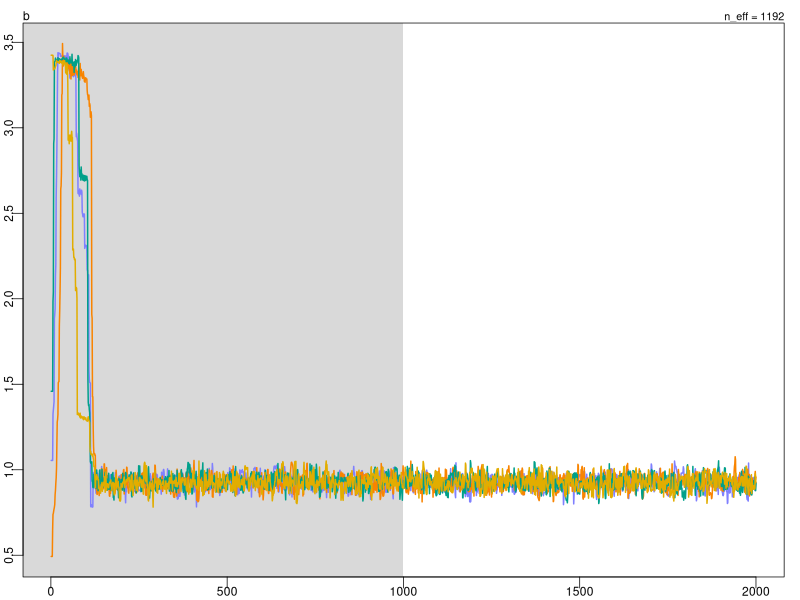

```{r setup, include=FALSE}
options(htmltools.dir.version = FALSE)
options(servr.daemon = TRUE)#para que no bloquee la sesión
```

```{r xaringan-themer, include=FALSE, warning=FALSE}
library(xaringanthemer)
library(ggplot2)
library(ggthemes)

xaringanExtra::use_share_again()
xaringanExtra::use_fit_screen()
xaringanExtra::use_tachyons()

style_solarized_light(
  title_slide_background_color = "#586e75",# base 3
  header_color = "#586e75",
  text_bold_color = "#cb4b16",
  background_color = "#fdf6e3", # base 3
  header_font_google = google_font("DM Sans"),
  text_font_google = google_font("Roboto Condensed", "300", "300i"),
  code_font_google = google_font("Fira Mono"), text_font_size = "28px"
)
# clipboard
htmltools::tagList(
  xaringanExtra::use_clipboard(
    button_text = "Copy code <i class=\"fa fa-clipboard\"></i>",
    success_text = "Copied! <i class=\"fa fa-check\" style=\"color: #90BE6D\"></i>",
    error_text = "Not copied 😕 <i class=\"fa fa-times-circle\" style=\"color: #F94144\"></i>"
  ),
  rmarkdown::html_dependency_font_awesome()
  )
## ggplot theme
theme_Publication <- function(base_size = 14, base_family = "helvetica") {
    (theme_foundation(base_size = base_size, base_family = base_family)
        + theme(plot.title = element_text(face = "bold",
                                          size = rel(1.2), hjust = 0.5),
                text = element_text(),
                panel.background = element_rect(colour = NA),
                plot.background = element_rect(colour = NA),
                panel.border = element_rect(colour = NA),
                axis.title = element_text(face = "bold",size = rel(1)),
                axis.title.y = element_text(angle=90,vjust =2),
                axis.title.x = element_text(vjust = -0.2),
                axis.text = element_text(), 
                axis.line = element_line(colour="black"),
                axis.ticks = element_line(),
                panel.grid.major = element_line(colour="#f0f0f0"),
                panel.grid.minor = element_blank(),
                legend.key = element_rect(colour = NA),
                legend.position = "bottom",
                legend.direction = "horizontal",
                legend.key.size= unit(0.2, "cm"),
                ##legend.margin = unit(0, "cm"),
                legend.spacing = unit(0.2, "cm"),
                legend.title = element_text(face="italic"),
                plot.margin = unit(c(10,5,5,5),"mm"),
                strip.background = element_rect(colour = "#f0f0f0",fill = "#f0f0f0"),
                strip.text = element_text(face="bold")
                ))
    
}

```


# Model fit

.center[

]

---

# Posterior samples

```r
> samples
# A tibble: 2,000 × 3
           a         b     sigma
   <dbl[1d]> <dbl[1d]> <dbl[1d]>
 1      115.     0.889      4.78
 2      109.     1.02       5.30
 3      112.     0.928      5.07
 4      111.     0.949      5.30
 5      111.     0.955      5.04
 6      115.     0.872      5.19
 7      109.     1.01       5.13
 8      117.     0.844      5.00
 9      115.     0.882      4.94
10      112.     0.939      4.95
# … with 1,990 more rows
```

---

# How to get posterior samples?

- There is no general method to find high probability regions in arbitrary probability distributions.

- This mean most models are fit using purely computational methods.

---

# Curse of dimensionality 

- For simple parameters spaces, we can do grid search or some brute force method to find high probability regions

- This breaks down quickly as the number of parameters increases

#### High dimensional watermelons are awful 

.center[
```{r, out.width= 800, echo=FALSE}

```
]

---

# Typical set 

.center[
```{r, out.width= 500, echo=FALSE}

```
]

---

# Finding the typical set

.pull-left[
#### Typical set
```{r, out.width= 200, echo=FALSE}
knitr::include_graphics("../figures/typical_set2.png")
```
]

.pull-right[
#### MCMC method

.center[
```{r, out.width= 700, echo=FALSE}
knitr::include_graphics("../figures//MCMC_typical.png")
```
]
]
---

## MCMC samplers 

-  Metropolis–Hastings algorithms (broad class of samplers, very general)
  - Most methods in the wild are some flavor of this 
-  Reversible Jump MCMC (used in many phylogenetic packages)
  - Allows for posterior distributions with variable dimensionality
-  Usable non-mcmc methods: R-INLA - integrated nested Laplace approximation.
  - Great for structural equation modeling, much faster for some classes of models

---

## MCMC samplers 2

-  Gibbs samplers
    - Mostly surpassed, but still in wide use.
    - Can sample discrete parameters.
    - Requires particular types of priors.
    - Software: WinBugs, Bugs, Jags...
-  Hamiltonian Monte Carlo samplers
    - Latest generations samplers.
    - Fast and general.
    - Discrete parameters must be integrated.
    - Can fit dynamic models using differential equations.
    - Software: PyMC3, Edward, Stan (rethinking engine)...

---

## what makes these samplers different?

- Basically the transition proposal distribution 

.center[
  <div class="custom-box">
    \(
    P(\theta_{i+1} | \theta_i)
    \)
  </div>
]

- We can visualize what is going on with different samplers:
  [MCMC interactive gallery](https://chi-feng.github.io/mcmc-demo/app.html)

---

## Our model from yesterday

.center[
  <div class="custom-box">
  \(
  \begin{aligned} 
  y_i &\sim Normal(\mu_i, \sigma) \\
  \mu_i &= \alpha + \beta x_i  \\
  \alpha &\sim Normal(0, 20) \\
  \beta &\sim lognormal(0, 1) \\
  \sigma &\sim Exponential(1) \\
  \end{aligned} 
  \)
  </div>
]

---

## Code in rethinking

.pull-left[
#### Model

  <div class="custom-box">
  \(
  \begin{aligned} 
  y_i &\sim Normal(\mu_i, \sigma) \\
  \mu_i &= \alpha + \beta x_i  \\
  \alpha &\sim Normal(0, 20) \\
  \beta &\sim lognormal(0, 1) \\
  \sigma &\sim Exponential(1) \\
  \end{aligned} 
  \)
  </div>
]
.pull-right[
#### Code
```r
 # Data
library(rethinking)
d2 <- Howell1[ Howell1$age >= 18 , ] 

# Model
ulam(alist(
  y ~ normal(mu, sigma),
  mu <- a + b * x,
  a ~ normal(0, 20),
  b ~ lognormal(0, 1),
  sigma ~ exponential(1)), 
  data = list(y = d2$height, 
              x = d2$weight),
  iter = 1000, chains = 4, cores = 4)
```
]

---

## rethinking generates stan code
.pull-left[
```r
data{
    vector[352] y;
    vector[352] x;
}
parameters{
    real a;
    real<lower=0> b;
    real<lower=0> sigma;
}
model{
    vector[352] mu;
    sigma ~ exponential( 1 );
    b ~ lognormal( 0 , 1 );
    a ~ normal( 0 , 20 );
    for ( i in 1:352 ) {
        mu[i] = a + b * x[i];
    }
    y ~ normal( mu , sigma );
}
```
]
.pull-right[
```{r, out.width= 300, echo=FALSE}
knitr::include_graphics("../figures/stan_logo.png")
```
- [Stan](https://mc-stan.org/)
- [Stan Dev](https://github.com/stan-dev/stan)
]

---

## Sampler arguments

.pull-left[
- Chains
- Cores
- Iterations
- Warm-up (or burn-in)

#### Model summary
```r
> precis(fit)
        mean   sd   5.5%  94.5% n_eff Rhat4
a     112.97 2.00 109.83 116.19  1013  1.01
b       0.92 0.04   0.86   0.99  1004  1.01
sigma   5.08 0.20   4.78   5.40  1543  1.00
```
]
.pull-right[

#### Chains and convergence

.center[

]
]


---

## Model checking

After fitting the model, we can use the posterior to simulate synthetic data and compare to the data used to fit the model. Discrepancies can suggest paths to improve the model.

.center[
  <div class="custom-box">
    \(
    y_{sim} \sim P(y_{sim}|y) = P(y_{sim}|\theta) P(\theta|y)
    \)
  </div>
]

---

## Posterior simulations

.center[

]

---

## Posterior correlations

.center[

]

---

## Reparametrization

.pull-left[
- Scaling and shifting parameters can help with convergence

- Centering both x and y values
- Scaling x to unit variance

  <div class="custom-box">
    \(
    \begin{aligned} 
    \tilde y_i &= y_i - \bar y \\
    \tilde x_i &= \frac{x_i - \bar x}{sd(x)} \\
    \end{aligned} 
    \)
  </div>
]
.pull-right[
```{r, eval=FALSE}
# Pre-calculate means and sds
mean_x = mean(d2$weight)
sd_x = sd(d2$weight)
mean_y = mean(d2$height)

# Model
ulam(alist(
  y ~ normal(mu, sigma),
  mu <- a + b * x,
  a ~ normal(0, 1),
  b ~ lognormal(0, 1),
  sigma ~ exponential(1)), 
  data = list(
    y =  d2$height - mean_y,          #<<
    x = (d2$weight - mean_x)/sd_x),   #<<
  iter = 1000, chains = 4, cores = 4)
```
]

---

## Posterior after centering

.center[

]

---

## Collinear predictors

.pull-left[
The posterior can be used to interpret weird results. 

Returning to the primate milk example:

- $K_i$: caloric content of milk in several monkey groups
- $x_i$: milk fat content
- $z_i$: milk sugar content
]
.pull-right[
.center[
  <div class="custom-box">
    \(
    \begin{aligned}
      K_i &\sim Normal(\mu_i, \sigma) \\
      m1: \mu_i &= \alpha + \beta_x x_i \\
      m2: \mu_i &= \alpha + \beta_z z_i\\
      m3: \mu_i &= \alpha + \beta_x x_i + \beta_z z_i \\
      \alpha, \beta_x, \beta_z &\sim Normal(0, 0.5) \\
      \sigma &\sim Exponential(1)
    \end{aligned}
    \)
  </div>
]
]
---

## Shifting effects

.center[

]

Smaller effects and wider intervals

---

## Correlated coefficients - m3 model

.center[

]

---

## Correlated predictors

.center[

]


