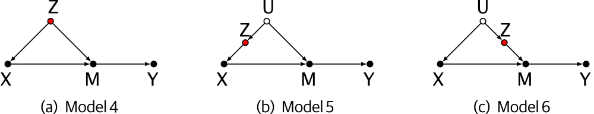

```{r setup, include=FALSE}
knitr::opts_chunk$set(echo = TRUE)
```

# dagitty package

Much of the causal implications contained in DAGs can be analised automatically. 
The dagitty package provides functions for this.

```{r}
if(!require("dagitty")) install.packages("dagitty")
library(dagitty)
```

# Good controls

When fitting causal models, it is often necessary to add covariates to a linear model in order to correctly identify the effect of interest. This means running a muiltiple regression in which one of the coefficients is related to the causal path of interest, and the others are added to the model in order to block non-causal paths. Many of the examples in this tutorial are from [Cinelli, Carlos, Andrew Forney, and Judea Pearl. "A crash course in good and bad controls." Sociological Methods & Research (2021): 00491241221099552.](https://ftp.cs.ucla.edu/pub/stat_ser/r493.pdf)

For example, in the following DAGs, where X, Y and Z are observed, and U is unobserved:


There is always a shared common cause between X and Y, and estimating the effect of X on Y requires blocking this non-causal path. The variable Z can be used as a covariate in all cases, even in the presence of the unobserved confound U.

Let's check this by simulating the DAG in model 2:

```{r}
N = 100
U = rnorm(N)
b_zu = 0.5
Z = rnorm(N, b_zu * U)
b_xz = 0.8
X = rnorm(N, b_xz * Z)
b_yu = 1
b_yx = 1
Y = rnorm(N, b_yu * U + b_yx * X)

lm(Y ~ X) |> coef() # Biased by non-causal path, effect of X is overestimated
lm(Y ~ X + Z) |> coef() # Unbiased, effect of X is correct and equal to b_yx
```


The same logic applies if the confound is mediated by another variable M:



Z should be added as a covariate in all of these cases. 


__Question__: If we are interested in the effect of X on Y, could M also be added to the model? Explain.

__Exercise__: Choose one of these DAGs and run a simulation, explore the effect of adding Z or M as covariates.

## Pretty good controls

Some covariates can be added to a model not to avoid bias, but to increase precision. For example, in the following DAG:

```{r, out.height=100, out.width=100, echo=FALSE}
knitr::include_graphics("../figures/DAGS/pretty_good.png")
```

Adding Z as a covariate increases the precision of the estimate of the effect of X on Y.

Again, let's check using simulations:

```{r}
set.seed(2)
library(rethinking)
N = 200
X = rnorm(N)
Z = rnorm(N)
b_yx = 1
b_yz = 2
Y = rnorm(N, b_yx * X + b_yz * Z)

yx = lm(Y ~ X) |> extract.samples()
yxz = lm(Y ~ X + Z) |> extract.samples()
dens(yxz$X, lwd = 2, col = 2, xlim = c(0.4, 1.65), xlab = "b_yx")
dens(yx$X, lwd = 2, col = 1, add =TRUE)
```

This happens because adding the covariate removes part of the variation in Y that is not associated with X. 

__Question__: What if Z is a cause of X, not of Y. Would adding it to the regression help in this case?

# Bad controls

## AIC and significance won't help you

To explore the effect of a bad control variable, let's simulate a collider:

```{r}
# DAG : X -> Z <- Y
N = 200
X = rnorm(N)
Y = rnorm(N)
Z = rnorm(N, Y + X)

m1 = lm(Y~X)   # Correct model
m2 = lm(Y~X+Z) # Model including the collider
```

First, let's look at the significance of the variables in both models:

```{r}
summary(m1)
summary(m2)
```

Not including Z gives the correct estimate of no effect of X on Y, but the model including Z tells us that both X and Z have significant effects on Y. Why is this?

How about AIC?

```{r}
AIC(m1, m2)
```


# Practice DAGs

For each of the following DAGs form the rethinking book, write down the correct models for estimating the total causal influence of X on Y:

```{r, out.height=100, out.width=400, out.height=285, echo=FALSE}
knitr::include_graphics("../figures/dags_6M3.png")
```

